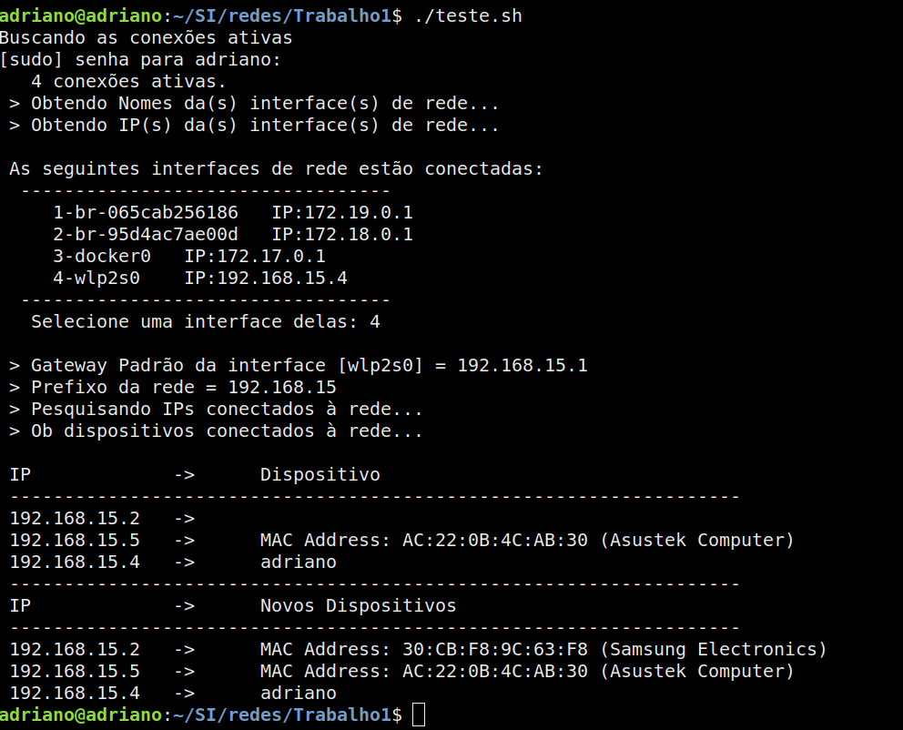

### Autodescoberta da rede

**Aluno:** Adriano Luis de Almeida   
**Disciplina:** GERÊNCIA DE REDES "A" - UFSM/2018   
**Disponível em:** https://github.com/adrianoluisalmeida/autodescoberta_rede/blob/master/readme.md   

*Desenvolvido utilizando o SO Debian 9*   
**Bibliotecas nescessárias:**   
net-tools   
samba-client   
nmblookup   
nmap   

*Linguagem de desenvolvimento: __bash__*   
*Banco de dados utilizado: sqlite (arquivo disponível em descoberta.dba)*   
*Para executar, basta rodar o arquivo .sh (./teste.sh)*   

Exemplo:

